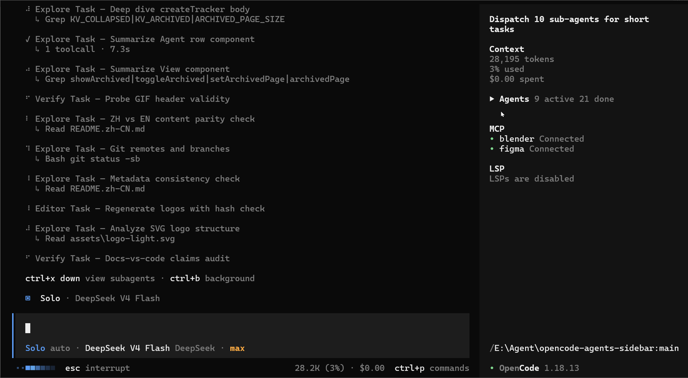

<p align="center">
  <picture>
    <source srcset="assets/logo-dark.svg" media="(prefers-color-scheme: dark)">
    <source srcset="assets/logo-light.svg" media="(prefers-color-scheme: light)">
    
  </picture>
</p>
<p align="center">Keep every OpenCode sub-agent in sight.</p>
<p align="center">
  <a href="https://www.npmjs.com/package/opencode-agents-monitor"></a>
  <a href="https://github.com/Dqz00116/opencode-agents-monitor/blob/main/LICENSE"></a>
</p>
<p align="center">
  English | <a href="README.zh-CN.md">中文</a>
</p>

---

An [OpenCode](https://opencode.ai) TUI plugin that brings live sub-agent progress straight into the session sidebar. See which agents are still working, what each one is doing, and the elapsed time, context, and cost for each, all without leaving your main session.

Expand an agent for its model, current tool, and cost. When you need the full story, open the child session directly from the sidebar.

<p align="center">
  
</p>

### Why use it?

Once a session fans out across several tasks, it becomes hard to tell what is still moving and what has already finished. The widget keeps that picture visible: active work updates in real time, completed agents move out of the way, and earlier child sessions reappear when the TUI starts.

### What you get

- **Live progress at a glance:** distinguish `thinking`, `tool`, `retry`, `done`, and `idle` states as they change
- **The current tool, while it runs:** see a concise call such as `bash npm test` before it finishes
- **Useful numbers, not noise:** context, elapsed time, model, and cost for each agent
- **A tidy long-running session:** completed agents are sorted into the paginated `Archived (n)` section automatically
- **Details on demand:** keep rows compact, expand the ones you care about, or use `[view]` to open the full child session; press `up` to return
- **History after a restart:** context and elapsed time for earlier agents are restored lazily from the API

### Compatibility

The two release lines use different plugin APIs and are not interchangeable: `0.2.x` targets the OpenCode v2 API (`@opencode/plugin@2`, `Plugin.define`), while `0.1.2` targets the v1 plugin shape (`@opencode-ai/plugin/tui`). Both lines are actively maintained.

| Plugin version | OpenCode version | Install | Configuration |
| --- | --- | --- | --- |
| `0.2.x` (`latest`) | v2 (`2.0.0+`) | `opencode plugin add opencode-agents-monitor` | Global `~/.config/opencode/cli.json` → `"plugins"` |
| `0.1.2` (v1 line, actively maintained; `opencode-v1` dist-tag) | v1 (`1.18.0+`) | `opencode plugin opencode-agents-monitor@0.1.2` | `tui.json` → `"plugin"` (global or project) |

On npm, `latest` follows the `0.2.x` line, while `0.1.2` stays available under the `opencode-v1` dist-tag.

### Installation

#### OpenCode v2

```bash
opencode plugin add opencode-agents-monitor
```

Or add it manually to the global `~/.config/opencode/cli.json`. In v2, TUI plugins are configured only there; `tui.json` is no longer read:

```json
{
  "plugins": ["opencode-agents-monitor"]
}
```

Restart OpenCode after installation. The widget appears in the session sidebar; press `ctrl+x`, then `b` if the sidebar is hidden.

<details>
<summary>OpenCode v1 line (actively maintained)</summary>

OpenCode v1 loads TUI plugins from the `"plugin"` array in `tui.json` and needs the `0.1.2` release, so pin the version explicitly:

```bash
opencode plugin opencode-agents-monitor@0.1.2
```

Or add to `~/.config/opencode/tui.json` (global) or `.opencode/tui.json` (project):

```json
{
  "plugin": ["opencode-agents-monitor@0.1.2"]
}
```

Once the `opencode-v1` dist-tag is published, `opencode-agents-monitor@opencode-v1` resolves to the same release and can replace the pinned version above.

</details>

### Usage

| Action | Result |
| --- | --- |
| Click the `Agents` header | Collapse or expand the entire widget (persists) |
| Click an agent row | Show or hide its model, current tool, and cost |
| Click `[view]` | Open the agent's complete child session |
| Click `Archived (n)` | Show or hide completed agents (persists) |
| Click `[<]` / `[>]` | Move through archived pages |

Status markers breathe while an agent is active; `!` means retrying, and `-` means idle or done.

### How it works

- Uses the TUI's official `sidebar_content` slot, the same extension point as the built-in Context and Todo widgets. No host patching required.
- Finds child sessions (`parentID`) from `session.created`, `session.updated`, and `session.deleted` events, plus one initial `session.list()` call.
- Combines `session.status` events (`busy` / `retry` / `idle`) with the shared message store to show live state and the latest tool call.
- Fetches `session.messages` once for completed agents when needed, restoring context size and elapsed time for historical sessions.
- Keeps widget state outside the slot component tree, so slot re-renders do not reset your expanded and archived preferences.

### Development

```bash
git clone https://github.com/Dqz00116/opencode-agents-monitor
cd opencode-agents-monitor
bun install
```

#### OpenCode v2

Point the global `~/.config/opencode/cli.json` at this checkout:

```json
{
  "plugins": ["/path/to/opencode-agents-monitor"]
}
```

For a local path, v2 resolves the physical `tui.js` in the repository root, which re-exports the build output `dist/index.js`, so run `bun run build` after changing the source.

#### OpenCode v1 line (actively maintained)

On v1, reference the source file from `tui.json`:

```json
{
  "plugin": ["./path/to/opencode-agents-monitor/src/index.tsx"]
}
```

This applies to the v1 source line only; as of `0.2.0` the source targets the v2 API, so use the `0.1.2` release if you need to debug the v1 plugin.

After changing the logo source, regenerate both variants with `node script/logo.mjs`.

### Publishing

The npm package must ship a compiled ESM entry. The host only applies its Solid JSX transform outside `node_modules`, so exporting raw `src/index.tsx` would cause the plugin to be skipped during loading.

```bash
bun install
bun run build # writes dist/index.js
```

Run `npm publish` after `npm login`. `0.2.0` goes to the `latest` dist-tag, while the v1 line is published under `opencode-v1`:

```bash
npm dist-tag add opencode-agents-monitor@0.1.2 opencode-v1
```

For local development, use the `tui.js` checkout path above on v2, or the source-based `tui.json` setup on the v1 line.

### License

MIT
